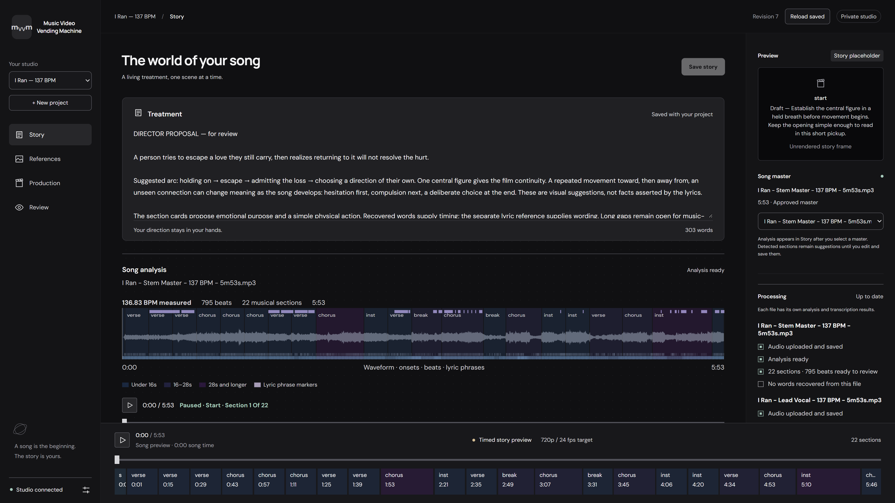

# Music Video Vending Machine (mvvm)

Personal narrative music-video studio. **Under construction; not production-ready.**

The approved [PRD](docs/PRD.md), [implementation backlog](docs/implementation-plan.md), and [build status](docs/build-status.md) define acceptance. Existing research is preserved under docs/research. Greptile must award the current implementation PR head 5/5 before merge, with checks green.



## Development

Requirements: Rust stable, Bun, FFmpeg/FFprobe, a private self-hosted Convex deployment, and RustFS. The coordinator binds to 127.0.0.1:5199; web development uses 127.0.0.1:5198 with strict port binding.

The `convex/` schema and internal functions live in this repository. The home `mvvm` instance runs on app-vm; infrastructure definitions and credential-name inventory live in the canonical proxmox-home repository. Media and large analysis payloads use the scoped RustFS `mvvm` bucket. See [migration evidence and remaining gates](docs/convex-migration-status.md).

Install backend dependencies with `bun install --frozen-lockfile`. Inject the variable names from `.env.example` through the private secret manager, then run:

```powershell
$env:MVVM_DEV_LOCAL = '1'
cargo run -p mvm-coordinator --locked
```

Convex URL/admin credentials and RustFS configuration are required in both modes. The coordinator never falls back to PostgreSQL or local asset files. It does not load `.env` automatically. Local mode permits only loopback binding; private deployment requires an operator bootstrap token and bounded operator sessions.

In another terminal:

```powershell
cd apps/web
bun install --frozen-lockfile
bun run dev
```

## Verification

```powershell
cargo fmt --all -- --check
cargo test --workspace
cargo clippy --workspace --all-targets -- -D warnings
node scripts/generate-contract.mjs --check
# Docker-backed acceptance: fresh local Convex, fake providers, no homelab credentials.
bun install --frozen-lockfile
bun run check:convex
bunx vitest run scripts/convex-migration.test.ts scripts/convex-persistence.test.ts
node --test scripts/migration-payloads.test.mjs scripts/convex-backup.test.mjs
node scripts/test-convex-http.mjs
cd apps/web
bun run check
bun run test
bun run build
```

Health: /api/v1/health. OpenAPI: /api/v1/openapi.json, or `cargo run -p mvm-coordinator -- --openapi` without service credentials.

No generation or final export is presented as available until its real integration gates pass. Current intake caps each request at 128 MiB; aligned audio stems and lyric wording references are supported; MIDI intake remains unavailable.

## Design and feasibility

Dark mode is the user-confirmed default. UI changes use the pinned [Impeccable workflow](docs/ui-design-workflow.md) alongside Svelte checks and real browser verification.

Local service/model feasibility probes live in `scripts/probe-*.py`; these are operator tools, not the production worker. Their receipts distinguish generated output from inspected acceptance and retain uncertain submissions without automatic retries. See [capability evidence](docs/evidence/2026-09-25-capabilities.md) for pinned workflows, measured results and remaining gates.

The [private storage and recovery evidence](docs/evidence/2026-09-25-private-recovery.md) covers scoped RustFS credentials, authenticated API restart checks and a cold fixture restored into a separate database and fresh object keys. That PostgreSQL evidence and `scripts/verify-local-recovery.py` are retained historical rollback material. Current Convex/RustFS backup and isolated restore evidence is in the migration record; scheduled/off-host retention remains pending.

Run deterministic probe guard tests without contacting providers:

```powershell
uv run --python 3.12 python -m unittest discover -s scripts -p 'test_probe*.py' -v
```
